# Worklab Architecture

## 1. Overview

Worklab is a local-first, single-user agent orchestration application. It exposes a `worklab` CLI, starts an Express HTTP/SSE server, serves a Preact/Vite UI, persists domain state in a local SQLite database, and spawns child worker processes that run AI agents against tasks, automations, team lead cycles, reviews, and assistant conversations. The runtime package normalizes Claude, Pi, and Codex execution, while Worklab owns task workflow state, persistence, MCP tool surfaces, UI, local service management, and optional Slack and Web Push integrations (`package.json:1-101`, `CLAUDE.md:5-27`, `src/coordinator.js:165-428`, `src/worker.js:81-168`).

The stack is Node.js 20+ ES modules, Express, better-sqlite3, Preact, Vite, Vitest, the MCP TypeScript SDK, Slack Bolt, `web-push`, `@worklab-ai/agent-runtime`, and `@worklab-ai/webhooks` (`package.json:69-100`). Runtime data defaults to `~/.worklab`, the default workspace is `~/worklab-workspace`, and `WORKLAB_*` environment variables or CLI flags can override host, port, data dir, workspace, and timeout settings (`src/core/config.js:26-45`, `src/core/env.js:47-61`, `AGENTS.md:67-91`).

Deployment is multi-process on one host: the CLI starts either a foreground coordinator or a per-user service; the coordinator owns the Express app, SQLite connection, schedulers, and optional services; each agent run is a separate `node src/worker.js` child process whose stdout is interpreted as structured runtime events (`src/cli/index.js:15-60`, `src/cli/start.js:76-93`, `src/coordinator.js:245-345`, `src/coordinator/spawn-worker.js:58-89`).

## 2. Architecture

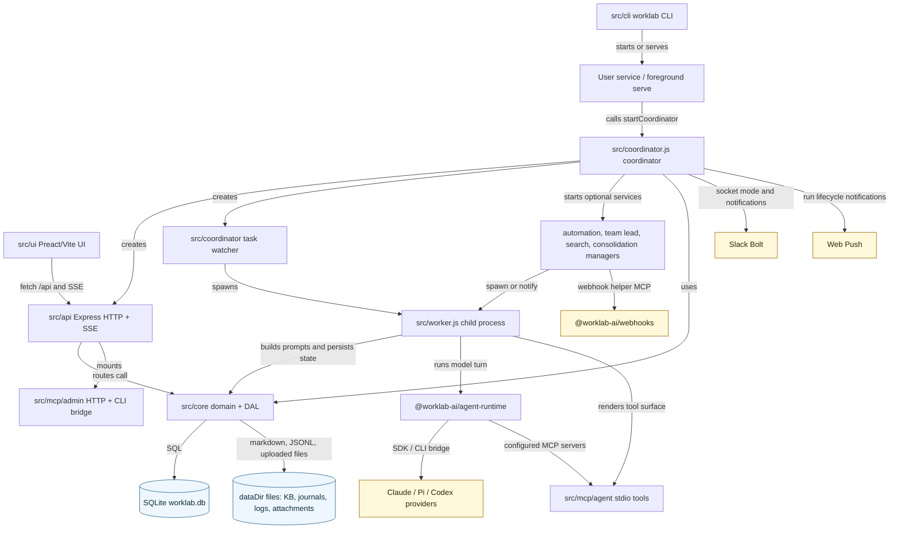

| Node | Responsibility | Source paths | Must not depend on |
|---|---|---|---|
| CLI | Dispatches `worklab` subcommands, applies config flags, bootstraps `.env`, starts/serves/restarts/stops services, and exposes the stdio admin MCP bridge. | `package.json:48-67`, `src/cli/index.js:15-60`, `src/cli/start.js:10-93`, `src/cli/README.md:1-32` | `src/api`, `src/integrations`, and `src/mcp`, except the documented `cli/mcp.js` admin bridge carve-out (`eslint.config.js:207-214`, `CLAUDE.md:13-25`). |
| Coordinator | Owns process startup, the singleton DB connection, Express server construction, task watcher, automation manager, team lead cron, search indexer, Slack, push notifications, event-loop monitor, and graceful shutdown. | `src/coordinator.js:165-428`, `src/coordinator/README.md:1-33` | API, MCP, integrations, CLI, worker, and direct `better-sqlite3` imports outside documented coordinator plumbing (`src/coordinator/README.md:13-17`, `eslint.config.js:216-228`). |
| API | Registers Express routes, JSON parsing, raw webhook ingress, `/api/health`, global and run SSE, route modules, admin MCP, static UI fallback, and error handling. | `src/api/server.js:83-141`, `src/api/sse.js:1-47`, `src/api/README.md:1-40` | Direct DB access and edge back-imports; API routes must use core helpers or `src/core/db/queries/*` (`src/api/README.md:3-16`, `eslint.config.js:96-108`, `eslint.config.js:182-190`). |
| UI | Browser-only Preact app mounted from `main.jsx`, hash-routed in `App.jsx`, lazy-loads secondary routes, uses one `/api` fetch wrapper, and runs through Vite HMR in dev. | `src/ui/src/main.jsx:1-8`, `src/ui/src/App.jsx:1-257`, `src/ui/src/lib/api.js:1-199`, `src/ui/vite.config.js:17-30`, `src/ui/README.md:1-40` | Node, DB, and core imports (`src/ui/README.md:1-8`). UI design tokens and shared primitives are governed by `docs/ui-design-system.md` and `scripts/guard-banned-tokens.sh` (`docs/ui-design-system.md:7-38`, `scripts/guard-banned-tokens.sh:1-42`). |
| Core | Domain layer and persistence boundary: config, DB lifecycle, schema, migrations, tasks, runs, settings, providers, credentials, KB, journals, memory, automations, embeddings, skills, MCP config, notifications, and runtime dispatch. | `src/core/index.js:1-120`, `src/core/README.md:1-34`, `src/core/db/open.js:6-18`, `src/core/db/schema/current.js:1-645` | Coordinator, worker, API, MCP, integrations, CLI, and `better-sqlite3` outside `src/core/db/**` (`src/core/README.md:14-18`, `eslint.config.js:175-180`). |
| Task Watcher | Converts task state into spawn decisions, prevents duplicate active runs, applies state-machine side effects, handles success/failure, schedules recoveries, resumes parents, auto-starts dependents, and emits lifecycle events. | `src/coordinator/task-watcher.js:79-120`, `src/coordinator/task-watcher.js:311-358`, `src/coordinator/task-watcher.js:691-983` | It is one of the documented coordinator carve-outs allowed to deep-import core internals (`eslint.config.js:88-90`, `eslint.config.js:110-136`). |
| Worker | Child process entrypoint. Reads env and CLI args, configures the runtime tool context, opens the DB, accepts drain/live-input control messages on stdin, dispatches task/review/automation/consolidation/lead-cycle runners, and emits final JSON to stdout. | `src/worker.js:1-168`, `src/worker/task-runner.js:74-162` | It should use core/agent/runtime seams, not API or service control paths (`CLAUDE.md:19-25`, `eslint.config.js:216-228`). |
| Agent Runtime Package | Generic provider/kernel package. `createRuntime()` resolves a bridge from `options.model` and `executionMode`, configures tool runtime callbacks, and returns normalized text, structured result, events, usage, cost, errors, diagnostics, and provider session IDs. | `packages/agent-runtime/package.json:1-49`, `packages/agent-runtime/README.md:1-190`, `packages/agent-runtime/src/runtime.js:1-73`, `src/core/ai.js:1-10`, `src/core/ai.js:540-608` | Worklab DB/domain/edge layers; boundary lint treats provider and kernel layers as reusable (`eslint.config.js:9-19`, `eslint.config.js:157-167`). |
| MCP | Admin MCP is a bearer-token HTTP surface and CLI bridge for trusted automation. Agent MCP is a per-run stdio tool surface for journals, memory, task graph, worktrees, agent management, and KB access. | `src/mcp/README.md:1-58`, `src/mcp/admin/server.js:1-88`, `src/mcp/admin/tools/index.js:1-52`, `src/mcp/agent/server.js:1-39`, `src/mcp/agent/tools/index.js:1-53` | Direct DB, API, integrations, CLI, coordinator, and worker imports (`src/mcp/README.md:16-24`, `eslint.config.js:192-199`). |
| Integrations | Optional external adapters. Slack Bolt listens in socket mode and triages messages through the agent runtime; push notifications subscribe to run lifecycle events and deliver Web Push payloads. | `src/integrations/README.md:1-26`, `src/integrations/slack/service.js:254-675`, `src/integrations/push/service.js:1-88` | Direct DB package imports, API self-calls, CLI, coordinator, worker, and MCP (`src/integrations/README.md:7-15`, `eslint.config.js:201-205`). |
| Webhooks Package | Reusable helpers and MCP stdio server used by automation webhook ingress and built-in MCP server discovery. | `packages/webhooks/package.json:1-46`, `packages/webhooks/README.md:1-15`, `src/api/routes/automations.js:1-5`, `src/core/mcp-config.js:79-90` | It is a workspace package with no Worklab DB dependency in its manifest (`packages/webhooks/package.json:40-45`). |

Boundary enforcement is executable: `eslint.config.js` places all layer-import rules at error level, bans direct `db.prepare()` in `src/api/**`, requires edge layers to use `src/core/index.js` except query helpers, and guards deleted compatibility shims (`eslint.config.js:1-19`, `eslint.config.js:96-136`, `eslint.config.js:157-243`). `scripts/guard-imports.sh` runs ESLint over `src packages` and fails on errors (`scripts/guard-imports.sh:1-25`).

## 3. Data Model

The authoritative schema is `src/core/db/schema/current.js`; schema version 44 enables WAL and SQLite foreign keys, and `getDb()` runs migrations before returning the singleton connection (`src/core/db/schema/current.js:1-5`, `src/core/db/open.js:6-18`, `src/core/db/migrations/runner.js:1-90`).

### Workflow Graph

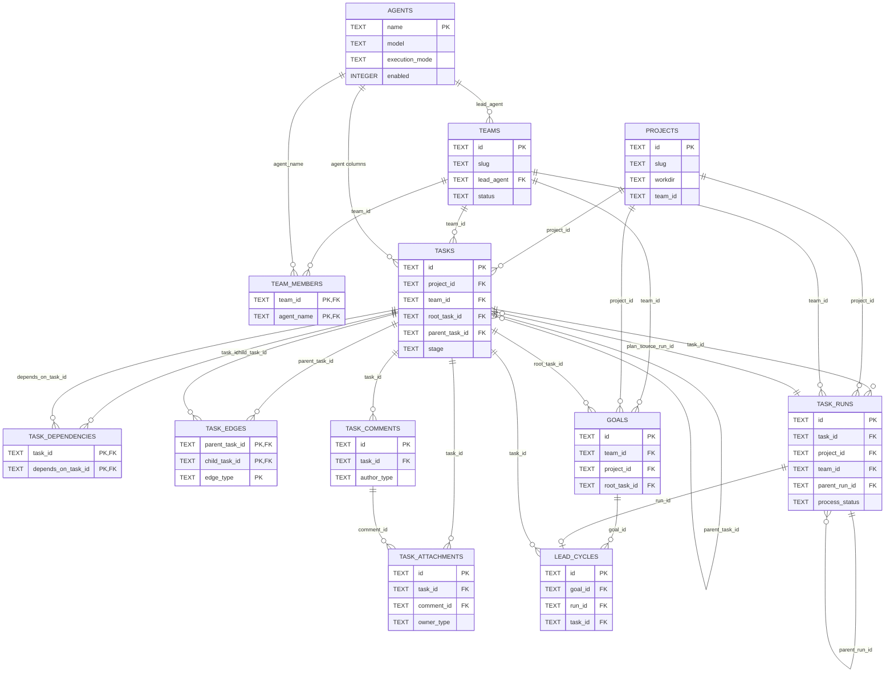

`projects.team_id`, `task_runs.agent_name`, `tasks.delegated_by_run_id`, `task_edges.created_by_run_id`, and `assistant_messages.run_id` are columns with indexes or semantic use but no SQLite `REFERENCES` clause in the current schema, so they are not drawn as FK edges (`src/core/db/schema/current.js:64-79`, `src/core/db/schema/current.js:81-154`, `src/core/db/schema/current.js:188-242`, `src/core/db/schema/current.js:574-585`).

### Runtime, Search, And Automation

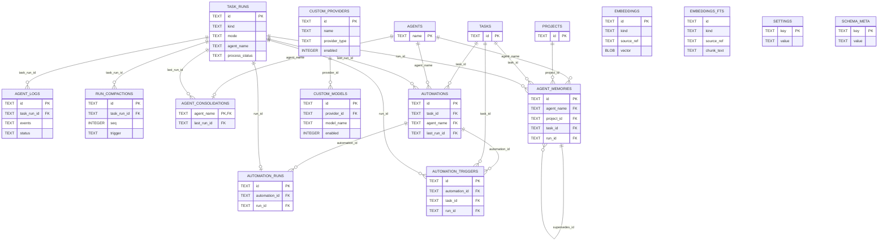

`embeddings_fts` is a virtual FTS5 table that shares logical IDs with `embeddings`, but the schema does not declare a foreign key because SQLite virtual tables do not support the same FK declaration in this statement (`src/core/db/schema/current.js:383-411`). Knowledge, journals, memory markdown files, skills, uploaded attachments, and raw run logs are stored under the data directory by core helpers, not as separate SQL tables (`src/core/kb.js:79-85`, `src/core/journal.js:4-105`, `src/core/skills.js:52-87`, `src/core/task-attachments.js:58-64`, `src/coordinator/spawn-worker.js:158-160`, `src/api/routes/runs.js:230-246`).

### Slack, Assistant, And Notifications

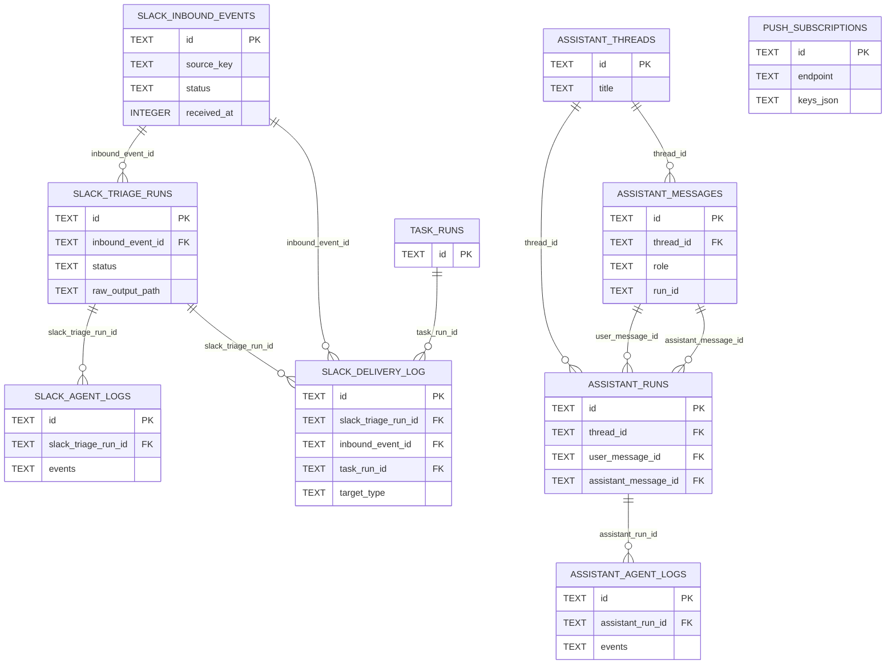

### Entity Inventory

| Entity | Purpose | Primary key and FKs | Notable invariants | Source file |
|---|---|---|---|---|
| `schema_meta` | Stores schema metadata. | PK `key`; no FKs. | `value` is required. | `src/core/db/schema/current.js:7-10` |
| `agents` | Agent definitions and runtime configuration. | PK `name`; no FKs. | Model, SDK, effort, allowlists, review flag, execution mode, and enabled flag live here. | `src/core/db/schema/current.js:12-35` |
| `teams` | Team roster owner and lead-cycle scheduling/budget metadata. | PK `id`; FK `lead_agent -> agents(name)`. | `slug` is unique; status defaults active. | `src/core/db/schema/current.js:37-53` |
| `team_members` | Agent membership in teams. | Composite PK `(team_id, agent_name)`; FKs to `teams` and `agents`. | Cascades on team or agent deletion. | `src/core/db/schema/current.js:55-62` |
| `projects` | Project metadata and workdir/worktree configuration. | PK `id`; no declared FKs. | `slug` unique; `team_id` is indexed but not a schema FK. | `src/core/db/schema/current.js:64-79` |
| `tasks` | Workflow task tree, assignment, stage, policy, plan, failure, and goal metadata. | PK `id`; FKs to `projects`, `teams`, `tasks`, `agents`, `task_runs`. | `task_key` and `client_request_id` are unique when present; synthetic team roots are unique per `(team_id, project_id)`. | `src/core/db/schema/current.js:81-135` |
| `task_dependencies` | Blocking edges between tasks. | Composite PK `(task_id, depends_on_task_id)`; both FKs to `tasks`. | Replacement helper deletes/reinserts the full set after pre-validating cycles. | `src/core/db/schema/current.js:137-144`, `src/core/db/queries/task-dependencies.js:96-109` |
| `task_edges` | Parent-child/task graph edges beyond direct task columns. | Composite PK `(parent_task_id, child_task_id, edge_type)`; task FKs. | `created_by_run_id` is not a FK in the schema. | `src/core/db/schema/current.js:146-156` |
| `task_comments` | Human, system, and agent comments on tasks. | PK `id`; FK `task_id -> tasks(id)`. | Ordered by task and creation time. | `src/core/db/schema/current.js:158-166` |
| `task_attachments` | Task instruction and comment attachments. | PK `id`; FKs to `tasks` and optional `task_comments`. | Supports path and upload attachments with metadata. | `src/core/db/schema/current.js:168-186`, `src/core/task-attachments.js:126-180` |
| `task_runs` | Process/run records for tasks, reviews, automations, lead cycles, and recovery continuations. | PK `id`; FKs to `tasks`, `projects`, `teams`, and self `parent_run_id`. | Separates legacy `status` from `process_status`; stores artifacts, raw log path, diagnostics, costs, worktree, session, and transcript-tail data. | `src/core/db/schema/current.js:188-242` |
| `goals` | One goal contract per team/project pair. | PK `id`; FKs to `teams`, `projects`, optional root `tasks`. | Unique `(team_id, project_id)`. | `src/core/db/schema/current.js:243-258` |
| `lead_cycles` | Team lead-cycle run audit and outcome data. | PK `id`; FKs to `goals`, unique `task_runs`, `tasks`, `teams`, `projects`. | Stores task creations/assignments/deletions/skips and goal refinement JSON. | `src/core/db/schema/current.js:260-305` |
| `agent_logs` | Display/log metadata for task runs. | PK `id`; FK `task_run_id -> task_runs(id)`. | Stores compactable event JSON and token/cost summary. | `src/core/db/schema/current.js:307-333` |
| `run_compactions` | Runtime compaction audit rows. | PK `id`; FK `task_run_id -> task_runs(id)`. | `seq` is indexed per run. | `src/core/db/schema/current.js:335-353` |
| `custom_providers` | User-configured OpenAI-compatible/Ollama-style providers. | PK `id`; no FKs. | `name` unique; API key is encrypted. | `src/core/db/schema/current.js:355-365`, `src/core/crypto.js:1-87` |
| `custom_models` | Models discovered or configured under a custom provider. | PK `id`; FK `provider_id -> custom_providers(id)`. | Unique `(provider_id, model_name)`. | `src/core/db/schema/current.js:367-381` |
| `embeddings` | Search chunks and optional vectors for KB, journals, and memory. | PK `id`; no FKs. | Unique `(kind, source_ref)`; vector presence is explicit. | `src/core/db/schema/current.js:383-403`, `src/core/embeddings.js:1-180` |
| `embeddings_fts` | FTS5 text index for embedding/search chunks. | Virtual table; no FK. | Stores `id`, `kind`, `source_ref`, title, and chunk text. | `src/core/db/schema/current.js:405-411` |
| `agent_consolidations` | Last consolidation state per agent. | PK/FK `agent_name -> agents(name)`; FK `last_run_id -> task_runs(id)`. | One row per agent. | `src/core/db/schema/current.js:413-418` |
| `agent_memories` | Structured agent memory facts with scope and evidence. | PK `id`; FKs to `agents`, `projects`, `tasks`, `task_runs`, and self `supersedes_id`. | Active dedupe unique index excludes archived memories. | `src/core/db/schema/current.js:420-446` |
| `automations` | Scheduled, one-off, manual, and webhook-triggered automation definitions. | PK `id`; FKs to optional `tasks`, optional `agents`, optional `task_runs`. | `webhook_id` unique when present; next fire indexed. | `src/core/db/schema/current.js:448-468`, `src/core/automations.js:36-160` |
| `automation_runs` | Join/audit table from automation to run. | PK `id`; FKs to `automations`, `task_runs`. | `run_id` unique. | `src/core/db/schema/current.js:470-479` |
| `automation_triggers` | Every automation trigger attempt and outcome. | PK `id`; FKs to `automations`, optional `tasks`, optional `task_runs`. | Records manual, automatic, and webhook outcomes. | `src/core/db/schema/current.js:481-493`, `src/core/automations.js:182-203` |
| `slack_inbound_events` | Deduplicated inbound Slack message events. | PK `id`; no FKs. | `source_key` unique; status moves queued/running/succeeded/failed. | `src/core/db/schema/current.js:495-512`, `src/integrations/slack/service.js:400-425` |
| `slack_triage_runs` | Slack triage agent runs. | PK `id`; FK `inbound_event_id -> slack_inbound_events(id)`. | Stores model, cost, summary, final JSON, raw log path. | `src/core/db/schema/current.js:514-536`, `src/integrations/slack/service.js:439-519` |
| `slack_agent_logs` | Event logs for Slack triage runs. | PK `id`; FK `slack_triage_run_id -> slack_triage_runs(id)`. | Stores event JSON and status. | `src/core/db/schema/current.js:538-545`, `src/integrations/slack/service.js:535-540` |
| `slack_delivery_log` | Slack reply/DM/task notification delivery audit. | PK `id`; FKs to optional Slack triage run, inbound event, and task run. | Logs success or failure response details. | `src/core/db/schema/current.js:547-565`, `src/integrations/slack/service.js:607-670` |
| `assistant_threads` | In-app assistant thread container. | PK `id`; no FKs. | Default title is "Personal assistant". | `src/core/db/schema/current.js:567-572` |
| `assistant_messages` | In-app assistant/user messages. | PK `id`; FK `thread_id -> assistant_threads(id)`. | `run_id` is indexed but not a declared FK. | `src/core/db/schema/current.js:574-585` |
| `assistant_runs` | In-app assistant run records. | PK `id`; FKs to assistant thread and optional user/assistant messages. | Stores model, cost, failure, raw log, warnings, diagnostics. | `src/core/db/schema/current.js:587-616`, `src/api/routes/assistant.js:1-69` |
| `assistant_agent_logs` | Event logs for assistant runs. | PK `id`; FK `assistant_run_id -> assistant_runs(id)`. | Stores event JSON and status. | `src/core/db/schema/current.js:617-624` |
| `push_subscriptions` | Browser Web Push subscriptions. | PK `id`; no FKs. | `endpoint` unique; disabled subscriptions are tracked. | `src/core/db/schema/current.js:626-639`, `src/integrations/push/service.js:55-83` |
| `settings` | JSON/string key-value settings. | PK `key`; no FKs. | Defaults are defined in core settings code. | `src/core/db/schema/current.js:641-644`, `src/core/settings.js:16-83` |

## 4. Key Flows

### Cold Start / Bootstrap

The CLI applies flags and loads `.env`, then `serve` starts the coordinator; `start` additionally builds/uses the UI bundle, installs/starts the user service, and waits for `/api/health`. The coordinator creates runtime directories, seeds template/default agents, opens/migrates SQLite, wires Express, watcher, managers, static UI, HTTP listen, PID file, optional services, and signal-driven shutdown.

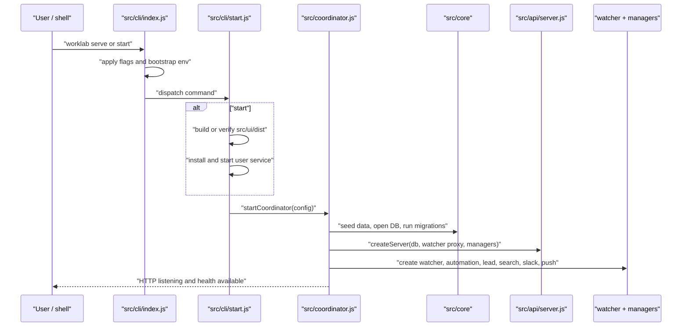

Sources in call order: `src/cli/index.js:15-60`, `src/core/env.js:51-61`, `src/cli/start.js:10-93`, `src/coordinator.js:165-345`, `src/api/server.js:83-141`.

### Synchronous Task Creation Request

`POST /api/tasks` is a synchronous request path from HTTP edge to persistence and response. It rejects obsolete `executor_agent`/`status` fields, validates title/stage/run policy/project/team/dependencies, dedupes by `client_request_id`, inserts the task, instruction attachments, and dependency edges in one transaction, returns the enriched task, broadcasts `task_created`, and schedules unassigned-team/auto-start side effects after response completion.

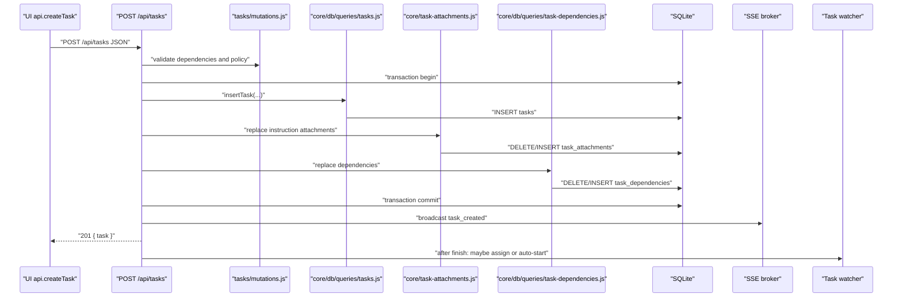

Sources in call order: `src/ui/src/lib/api.js:82-105`, `src/api/server.js:108-129`, `src/api/routes/tasks.js:366-477`, `src/api/routes/tasks/mutations.js:68-103`, `src/core/db/queries/tasks.js:250-277`, `src/core/task-attachments.js:234-262`, `src/core/db/queries/task-dependencies.js:100-109`, `src/api/routes/tasks.js:205-227`.

### Background Task Run Worker Lifecycle

Manual runs start with `POST /api/tasks/:id/run`; automatic runs use the same watcher path after task creation, dependency completion, or state transitions. The watcher validates the current stage, blockers, stage agent, review rules, and budget, inserts a `task_runs` row, prepares worktree/artifact/execenv state, spawns `node src/worker.js`, streams stdout events into `agent_logs` and raw JSONL logs, and finalizes task/run state when the child exits.

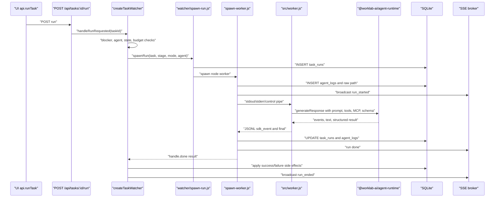

Sources in call order: `src/api/routes/tasks.js:812-830`, `src/coordinator/task-watcher.js:311-358`, `src/coordinator/watcher/spawn-run.js:42-266`, `src/coordinator/spawn-worker.js:58-160`, `src/coordinator/spawn-worker.js:620-899`, `src/worker.js:81-168`, `src/worker/task-runner.js:74-162`, `src/core/ai.js:540-608`, `packages/agent-runtime/src/runtime.js:50-73`, `src/coordinator/task-watcher.js:691-983`.

### Automation And Webhook Flow

Automations are persisted definitions with normalized triggers. Scheduled automations are polled every 60 seconds by the automation manager; task-bound webhook automations enter through a raw-body route before JSON middleware so the webhook package can normalize payloads. Task-bound automations call the normal watcher run path; standalone automations create a task-less `task_runs` row and spawn a worker in `automation` mode.

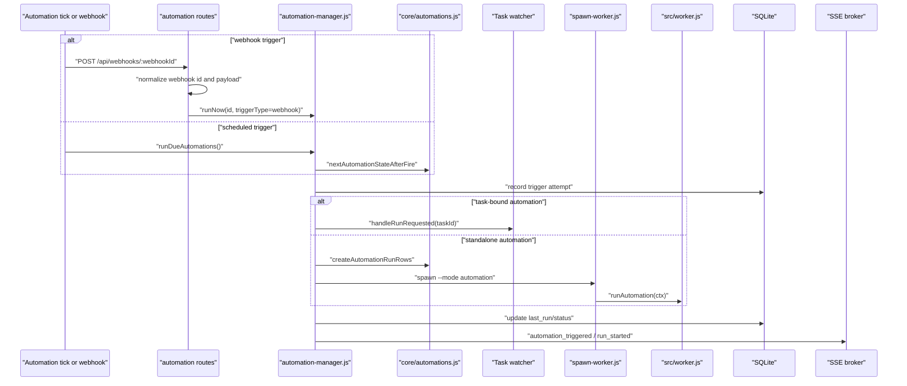

Sources in call order: `src/api/server.js:83-90`, `src/api/routes/automations.js:1-5`, `src/api/routes/automations.js:204-476`, `src/core/automations.js:36-203`, `src/coordinator/automation-manager.js:34-150`, `src/coordinator/automation-manager.js:176-409`, `src/worker.js:145-147`.

### Live Run Input, Logs, And Cancellation-Recovery Data

The run detail API prefers raw JSONL events when available, exposes run SSE, and can deliver live human messages to providers that support live input. The coordinator writes control messages to the worker stdin pipe; the worker validates and queues `live_user_message` control records. On coordinator shutdown it sends `worklab_drain`; a draining worker aborts cleanly, emits `drained`, and `spawn-worker` stores a transcript-tail snapshot for later resume.

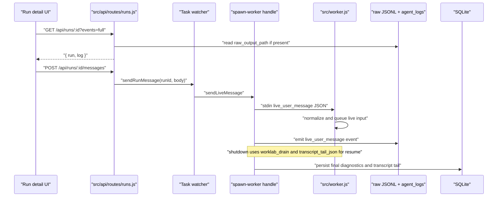

Sources in call order: `src/api/routes/runs.js:1-120`, `src/api/routes/runs.js:162-275`, `src/coordinator/spawn-worker.js:542-618`, `src/worker.js:22-79`, `src/coordinator/spawn-worker.js:788-813`.

### Slack Triage And Notifications

When Slack is enabled and tokens are present, the deferred Slack service starts a Bolt app in socket mode, filters message events, deduplicates them into `slack_inbound_events`, processes them serially through `generateResponse`, appends journal/memory updates, optionally replies or DMs, records delivery logs, and listens for Worklab run-ended events to DM task completion/error notifications.

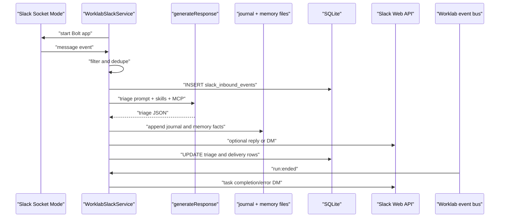

Sources in call order: `src/coordinator.js:324-334`, `src/integrations/slack/service.js:254-337`, `src/integrations/slack/service.js:369-438`, `src/integrations/slack/service.js:439-620`, `src/integrations/slack/service.js:650-675`, `src/core/db/schema/current.js:495-565`.

## 5. Data Flow

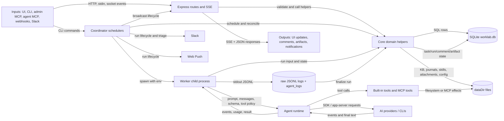

The main control and data sinks are the local SQLite database, files under `dataDir`, SSE channels, Slack/Web Push, and model/provider transports. Raw runtime events are kept as JSONL files when available and also compacted into `agent_logs.events` for display/tail hydration (`src/api/routes/runs.js:112-160`, `src/api/routes/runs.js:230-246`, `src/coordinator/spawn-worker.js:145-160`, `src/coordinator/spawn-worker.js:818-875`). Search data flows from KB/journal/memory files through the search indexer into `embeddings` and `embeddings_fts`, with startup scans and file watchers broadcasting `search_index_updated` (`src/coordinator/search-indexer.js:1-97`, `src/core/embeddings.js:1-180`).

## 6. Runtime & Operations

Processes start through `src/cli/index.js`; `serve` runs the coordinator in the foreground and `start` builds UI assets, installs/starts the user service, and polls `/api/health` (`src/cli/index.js:15-60`, `src/cli/start.js:51-93`). The coordinator refuses to start if another live PID exists for the same data dir, seeds data, opens `worklab.db`, serves `src/ui/dist`, listens on configured host/port, writes `.coordinator.pid`, schedules optional services after 250 ms, and returns handles for shutdown/testing (`src/coordinator.js:182-213`, `src/coordinator.js:290-345`, `src/coordinator.js:415-428`).

Shutdown is signal-driven. The coordinator drains active workers with `WORKLAB_DRAIN_TIMEOUT_MS`, stops managers, search, event-loop monitor, push, Slack, SSE broker, HTTP sockets, SQLite, and PID file. Worker drain is a structured stdin message; the child aborts its controller, emits `drained`, and exits cleanly so the coordinator can persist resume metadata (`src/coordinator.js:347-414`, `src/coordinator/spawn-worker.js:542-575`, `src/worker.js:22-79`, `src/coordinator/spawn-worker.js:788-813`).

Runtime data defaults to `~/.worklab`; config defaults include host `127.0.0.1`, port `7878`, workspace `~/worklab-workspace`, log level `info`, worker timeout, idle warning, log inline limit, drain timeout, and Slack token env fallbacks. `.env` files are loaded first from the repo and then the active data dir without overriding existing env (`src/core/config.js:26-45`, `src/core/env.js:31-61`). The README and AGENTS instructions document the same operational defaults and the Tailscale Serve pattern for tailnet access while keeping Worklab bound to localhost (`README.md:118-182`, `AGENTS.md:67-101`).

Secrets are local files or env values. Provider API keys are encrypted with AES-256-GCM using `PROVIDER_ENCRYPTION_KEY` or a generated data-dir key file; the admin MCP bearer token is a generated 32-byte hex token in `<dataDir>/mcp-token` with `0600` mode and timing-safe comparison; Web Push VAPID keys are generated into `<dataDir>/push-vapid.json` (`src/core/crypto.js:1-87`, `src/core/service-token.js:1-33`, `src/mcp/admin/server.js:38-88`, `src/core/web-push.js:31-57`).

Observability is implemented through `/api/health`, structured pino-compatible logging, slow API request logging, event-loop delay monitoring, run lifecycle SSE, per-run SSE, raw run logs, artifact files, Slack status endpoints, and push delivery failure handling (`src/api/server.js:30-72`, `src/api/server.js:92-106`, `src/coordinator.js:31-60`, `src/api/routes/runs.js:162-275`, `src/integrations/slack/service.js:340-367`, `src/integrations/push/service.js:55-83`). The npm release workflow validates with tests, UI build, package contents, whitespace, public npm metadata, and a published CLI `/api/health` smoke test (`.github/workflows/npm-release.yml:31-112`).

## 7. Conventions & Constraints

Module boundaries are explicit in per-layer READMEs and executable lint rules. Core owns DB and domain behavior; edge layers consume core through `src/core/index.js` or query helpers; API routes cannot call `db.prepare()` directly; the runtime package must not depend on Worklab domain/edge layers; deleted compatibility shims are banned (`src/core/README.md:1-19`, `src/api/README.md:1-17`, `src/coordinator/README.md:1-17`, `src/mcp/README.md:1-24`, `src/cli/README.md:1-32`, `src/integrations/README.md:1-26`, `eslint.config.js:1-243`).

Tests mirror source boundaries and must avoid the developer's real `~/.worklab`; tests that touch runtime files, services, tokens, databases, logs, MCP config, or backups set `WORKLAB_DATA_DIR` to temp directories. API tests use `supertest`, CLI/core/MCP/UI tests are separated by folder, long-running workers and provider SDKs should be stubbed unless the test is intentionally end-to-end, and substantial changes should run `npm test`, `npm run build:ui`, and `git diff --check` (`AGENTS.md:103-146`, `CONTRIBUTING.md:11-39`, `CLAUDE.md:51-59`).

Workflow constraints: use the v2 task workflow, keep task workflow stage separate from run process state, converge agent runtimes on a structured `worklab_result` contract, require agents to change tasks/subtasks through controlled APIs or MCP tools, and surface recovery from provider errors, invalid results, stale workers, cancellations, and rejection loops as explicit user-facing state (`CONTRIBUTING.md:30-39`, `CLAUDE.md:93-99`). Agents and implementers must not resurrect deleted historical planning docs; the current references are source, tests, README, CONTRIBUTING, and `docs/audits/task-agent-logic-audit.md` (`AGENTS.md:20-22`, `CONTRIBUTING.md:3-10`).

UI work must stay within the shared design system: tokens and shared class contracts live in `src/ui/src/styles.css`, primitives and layout components own reusable UI, the design-system route must cover shared components, and guard scripts reject high-risk token drift (`src/ui/README.md:28-40`, `docs/ui-design-system.md:7-38`, `docs/ui-design-system.md:85-120`, `scripts/guard-banned-tokens.sh:1-42`).
