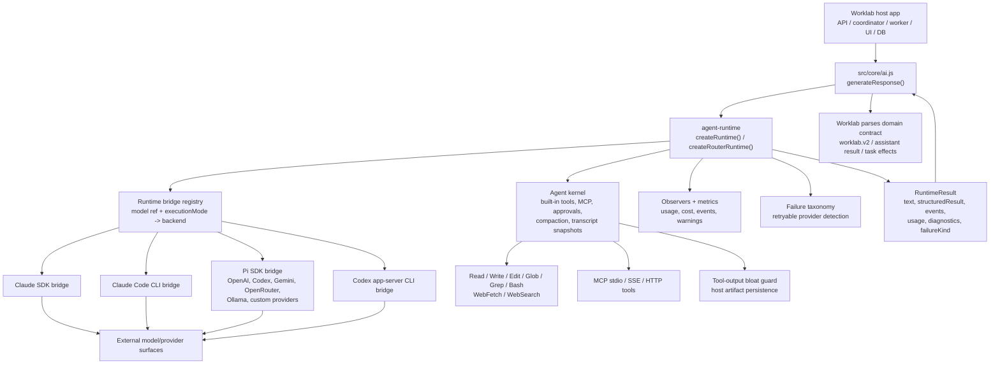
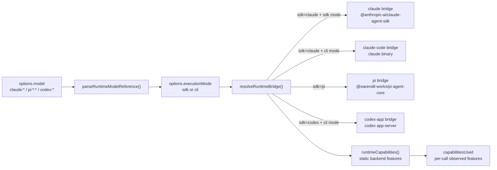
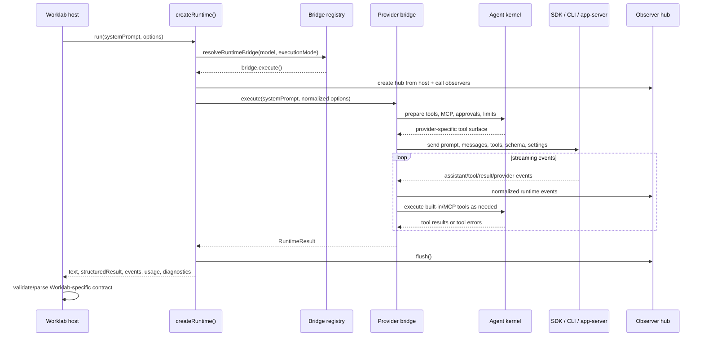
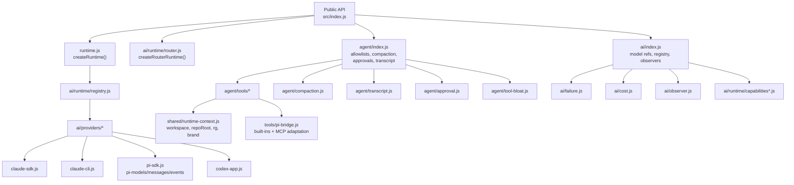
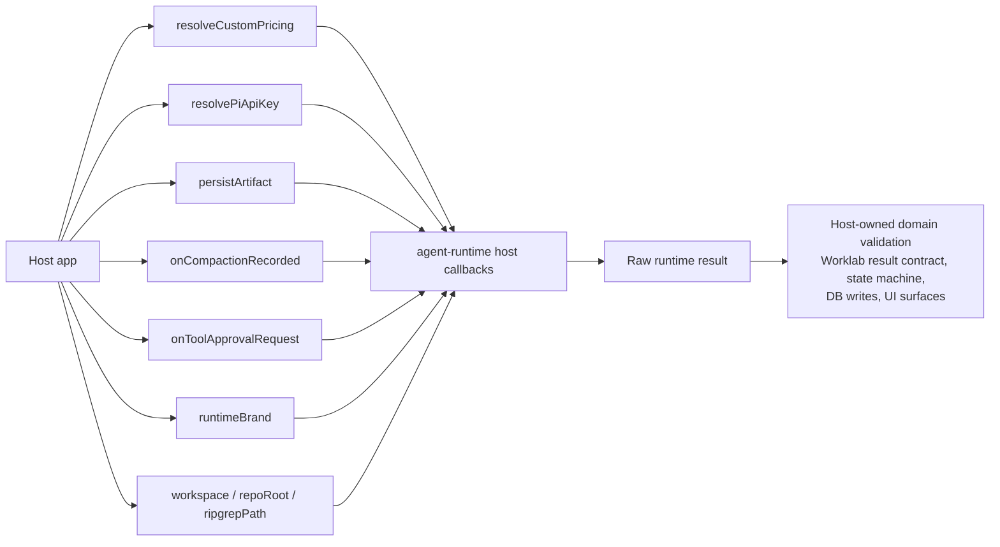

# Agent Runtime Architecture

## What It Is

`@worklab-ai/agent-runtime` is Worklab's provider-agnostic agent execution
kernel. It does not own tasks, database state, UI, scheduling, or Worklab's
domain-specific result contract. It owns the lower-level act of running an
agent turn:

- pick the right backend from a model reference and execution mode
- expose built-in tools, MCP tools, approvals, structured output, and live input
- normalize provider events into one runtime event stream
- classify runtime failures and retryable provider errors
- collect usage, cost, cache, capability, and warning telemetry
- return raw text plus raw structured output to the host

Worklab consumes the package mainly through `src/core/ai.js`, while the package
entry point is `src/runtime.js`.

## Package Boundary

The runtime stays below Worklab domain behavior. Provider code in this package
must not import Worklab DB, API, coordinator, or UI modules. Worklab passes
host callbacks and pre-resolved settings into the runtime instead.

## Runtime Selection

Canonical active model references are:

- `claude:<modelId>` for Claude SDK or Claude Code CLI, selected by
  `executionMode`
- `pi:<providerId>:<modelName>` for Pi SDK providers
- `codex:<modelId>` for Codex app-server CLI

Legacy aliases are canonicalized at host ingress when needed. The strict parser
keeps the package boundary honest by rejecting reserved runtime IDs such as
`openai:*`, `vercel:*`, and `claude-code:*`.

## Run Lifecycle

The package forwards provider structured output as `structuredResult`, but it
does not validate that output against Worklab's domain schema. Hosts own that
validation and any state-machine side effects.

## Main Subsystems

Key responsibilities by subsystem:

- `runtime.js`: binds host callbacks once, configures tool runtime context, and
  routes each call to the resolved bridge.
- `ai/runtime/registry.js`: maps model reference plus execution mode to one of
  the built-in provider bridges.
- `ai/runtime/router.js`: retries across an ordered fallback chain on retryable
  provider failures, carrying a transcript-tail resume snapshot forward.
- `ai/providers/*`: owns provider-specific request shapes, event conversion,
  structured-output extraction, native subagent wiring, usage, and diagnostics.
- `agent/tools/*`: implements built-in tools, path/workdir guards, MCP tool
  adaptation, Playwright artifact routing, and output limits.
- `agent/compaction.js`: estimates context pressure and compacts long agent
  conversations for providers that support the package's compaction loop.
- `agent/transcript.js`: builds bounded resume snapshots from prior provider
  events so a fallback or continuation can keep context.
- `agent/approval.js`: provides host-driven human-in-the-loop tool approval
  gates where the backend supports runtime tool dispatch.
- `ai/failure.js`: normalizes spawn, usage-limit, provider, cancellation, and
  retryability decisions into stable failure kinds.

## Host Responsibilities

The host is responsible for:

- resolving credentials and custom provider/model rows before provider calls
- choosing model references, execution mode, effort, fallback chains, and
  runtime settings
- persisting artifacts, compaction rows, raw logs, run rows, and UI-facing state
- validating structured output against the host's domain contract
- converting runtime failures into product workflow behavior
- deciding when to retry, recover, continue, cancel, or ask for user input

## Essential Takeaway

Think of `@worklab-ai/agent-runtime` as the portable agent process engine
underneath Worklab. Worklab decides what a task means, which agent should run,
how state changes, and how results are persisted. The runtime decides how to
talk to Claude, Pi, and Codex execution surfaces; how tools are exposed; how
provider failures are normalized; and how enough telemetry is returned for a
host to make reliable orchestration decisions.
